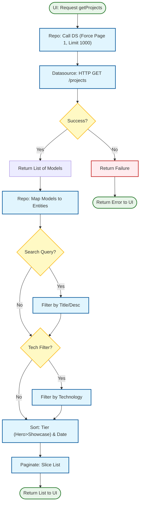

```mermaid
flowchart TD
    Start(["UI: Request getProjects"]) --> RepoCall["Repo: Call DS (Force Page 1, Limit 1000)"]
    RepoCall --> DS["Datasource: HTTP GET /projects"]
    
    DS --> CheckStatus{"Success?"}
    CheckStatus -- No --> Error["Return Failure"]
    CheckStatus -- Yes --> RawData["Return List of Models"]
    
    RawData --> Map["Repo: Map Models to Entities"]
    
    Map --> CheckSearch{"Search Query?"}
    CheckSearch -- Yes --> FilterSearch["Filter by Title/Desc"]
    CheckSearch -- No --> CheckTech
    FilterSearch --> CheckTech
    
    CheckTech{"Tech Filter?"}
    CheckTech -- Yes --> FilterTech["Filter by Technology"]
    CheckTech -- No --> Sort
    FilterTech --> Sort
    
    Sort["Sort: Tier (Hero>Showcase) & Date"] --> Paginate["Paginate: Slice List"]
    
    Paginate --> Return(["Return List to UI"])
    Error --> ReturnError(["Return Error to UI"])

    classDef process fill:#e1f5fe,stroke:#01579b,stroke-width:2px;
    classDef decision fill:#fff9c4,stroke:#fbc02d,stroke-width:2px;
    classDef terminator fill:#e8f5e9,stroke:#2e7d32,stroke-width:2px;
    classDef error fill:#ffebee,stroke:#c62828,stroke-width:2px;

    class RepoCall,DS,Map,FilterSearch,FilterTech,Sort,Paginate process;
    class CheckStatus,CheckSearch,CheckTech decision;
    class Start,Return,ReturnError terminator;
    class Error error;
```
