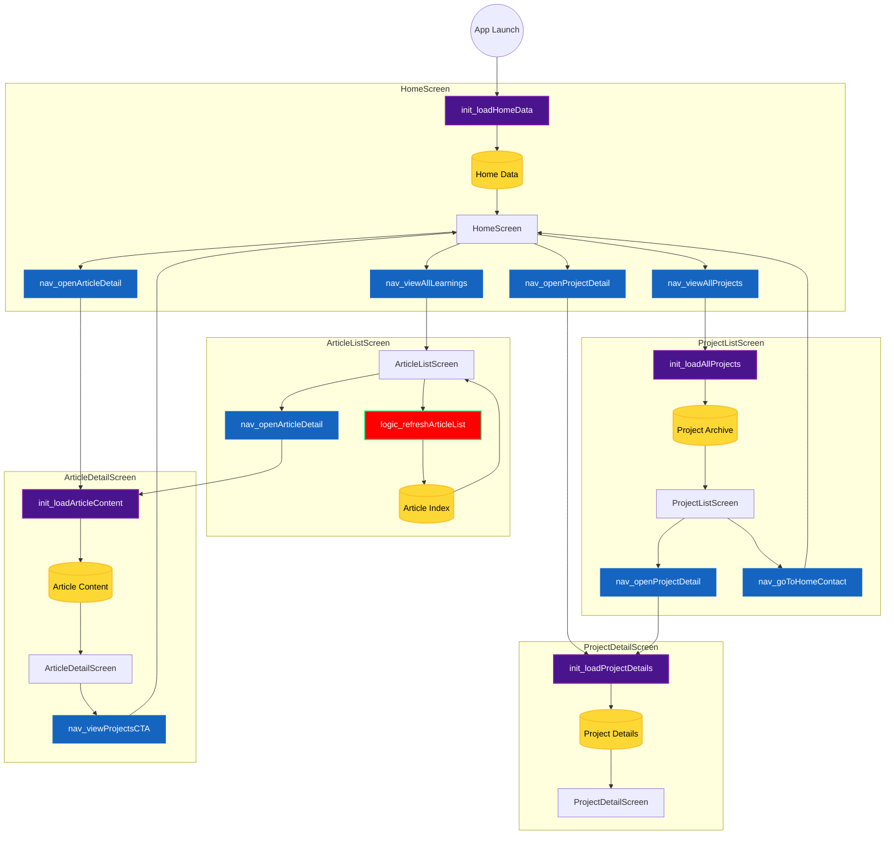

# Portfolio

[HomePage](Portfolio/HomePage%202bb07832c1de80e8b642eec70971a206.md)

[Project List Page](Portfolio/Project%20List%20Page%202bb07832c1de80b9ab50ed136e48feec.md)

[Project Detail screen](Portfolio/Project%20Detail%20screen%202bb07832c1de80a582dde07f4c02ea9d.md)

[Article List Screen](Portfolio/Article%20List%20Screen%202bb07832c1de8054aaa4c58ca8766780.md)

[Article Detail Screen](Portfolio/Article%20Detail%20Screen%202bb07832c1de806f8b6af194cc4a9593.md)

[Model](Portfolio/Model%202bb07832c1de8022ac2ad322a97ea351.md)

```mermaid
graph TD
    %% --- Mandatory Style Definitions ---
    classDef pureUI fill:#2e7d32,color:#ffffff,stroke:none
    classDef navAction fill:#1565c0,color:#ffffff,stroke:none
    classDef dataSourceTrigger fill:#FF0000,stroke:#00e676,color:#ffffff,stroke-width:2px
    classDef lifecycle fill:#4a148c,stroke:#7b1fa2,color:#ffffff,stroke-width:2px
    classDef database fill:#fdd835,stroke:#fbc02d,color:#000000,stroke-width:2px

    %% --- 1. Home Scope ---
    subgraph Home_Scope [HomeScreen Scope]
        Home[HomeScreen]
        Life_InitHome[init_loadHomeData]:::lifecycle
        DB_Home[(Home Data)]:::database
        
        %% Exits
        Nav_AllProjects[nav_viewAllProjects]:::navAction
        Nav_AllLearnings[nav_viewAllLearnings]:::navAction
        Nav_ProjDet_Home[nav_openProjectDetail]:::navAction
        Nav_ArtDet_Home[nav_openArticleDetail]:::navAction

        %% Interactions
        UI_Scroll[ui_scrollToSection]:::pureUI
        UI_Menu_Home[ui_toggleMobileMenu]:::pureUI
        Logic_Ext[logic_openExternalLink / logic_openRepo]:::dataSourceTrigger
        Logic_Mail[logic_sendEmail]:::dataSourceTrigger

        %% Wiring
        Home --> Nav_AllProjects
        Home --> Nav_AllLearnings
        Home --> Nav_ProjDet_Home
        Home --> Nav_ArtDet_Home
        Home --> UI_Scroll & UI_Menu_Home
        Home --> Logic_Ext & Logic_Mail
        
        Life_InitHome --> DB_Home
        DB_Home --> Home
    end

    %% --- 2. Project List Scope ---
    subgraph PList_Scope [ProjectListScreen Scope]
        ProjectList[ProjectListScreen]
        Life_InitPL[init_loadAllProjects]:::lifecycle
        DB_Projects[(Project Archive)]:::database

        %% Exits
        Nav_ProjDet_PL[nav_openProjectDetail]:::navAction
        Nav_Contact_PL[nav_goToHomeContact]:::navAction

        %% Interactions
        UI_Menu_PL[ui_toggleMobileMenu]:::pureUI

        %% Wiring
        ProjectList --> Nav_ProjDet_PL
        ProjectList --> Nav_Contact_PL
        ProjectList --> UI_Menu_PL

        Life_InitPL --> DB_Projects
        DB_Projects --> ProjectList
    end

    %% --- 3. Article List Scope ---
    subgraph AList_Scope [ArticleListScreen Scope]
        ArticleList[ArticleListScreen]
        DB_Articles[(Article Index)]:::database
        
        %% Exits
        Nav_ArtDet_AL[nav_openArticleDetail]:::navAction

        %% Interactions (Filter Logic)
        UI_Filter[ui_modifyFilterState]:::pureUI
        Logic_Refresh[logic_refreshArticleList]:::dataSourceTrigger
        Logic_LoadMore[logic_loadMoreArticles]:::dataSourceTrigger
        
        %% UI Toggles
        UI_Tags[ui_toggleTagMenu]:::pureUI
        UI_Theme_AL[ui_toggleTheme]:::pureUI

        %% Wiring
        ArticleList --> Nav_ArtDet_AL
        ArticleList --> UI_Filter
        UI_Filter --> Logic_Refresh
        
        Logic_Refresh --> DB_Articles
        DB_Articles --> ArticleList
        
        ArticleList --> Logic_LoadMore
        Logic_LoadMore --> DB_Articles
        
        ArticleList --> UI_Tags & UI_Theme_AL
    end

    %% --- 4. Project Detail Scope ---
    subgraph PDetail_Scope [ProjectDetailScreen Scope]
        ProjectDetail[ProjectDetailScreen]
        Life_InitPD[init_loadProjectDetails]:::lifecycle
        DB_ProjDetails[(Project Details)]:::database

        %% Interactions
        Logic_DL[logic_downloadArtifact / logic_openAppStore]:::dataSourceTrigger
        Logic_Source[logic_openSourceCode]:::dataSourceTrigger

        %% Wiring
        Life_InitPD --> DB_ProjDetails
        DB_ProjDetails --> ProjectDetail

        ProjectDetail --> Logic_DL & Logic_Source
    end

    %% --- 5. Article Detail Scope ---
    subgraph ADetail_Scope [ArticleDetailScreen Scope]
        ArticleDetail[ArticleDetailScreen]
        Life_InitAD[init_loadArticleContent]:::lifecycle
        DB_ArtDetails[(Article Content)]:::database

        %% Exits
        Nav_HomeCTA[nav_viewProjectsCTA]:::navAction

        %% Interactions
        UI_Theme_AD[ui_toggleTheme]:::pureUI

        %% Wiring
        Life_InitAD --> DB_ArtDetails
        DB_ArtDetails --> ArticleDetail

        ArticleDetail --> Nav_HomeCTA
        ArticleDetail --> UI_Theme_AD
    end

    %% --- Inter-Scope Flow Connections ---
    Start((App Launch)) --> Life_InitHome
    
    %% Navigation between modules (Implicit args passed)
    Nav_AllProjects --> Life_InitPL
    Nav_AllLearnings --> ArticleList
    
    %% Detail Loads (Passing IDs)
    Nav_ProjDet_Home --> Life_InitPD
    Nav_ProjDet_PL --> Life_InitPD
    
    Nav_ArtDet_Home --> Life_InitAD
    Nav_ArtDet_AL --> Life_InitAD

    %% Specific CTAs (Not Generic Backs)
    Nav_Contact_PL --> Home
    Nav_HomeCTA --> Home
```

